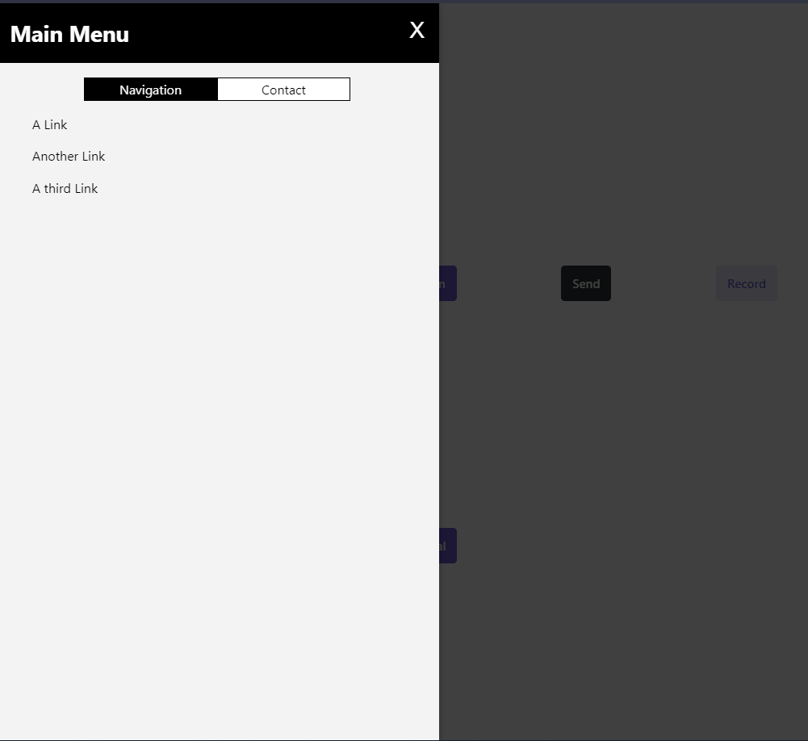
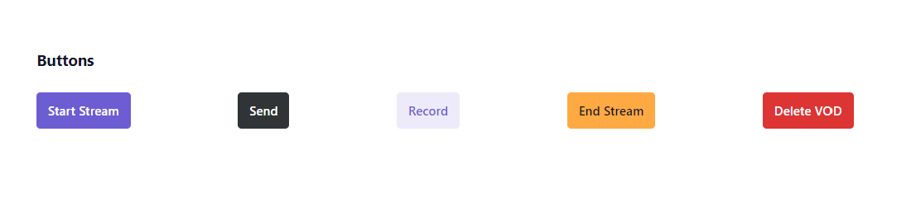
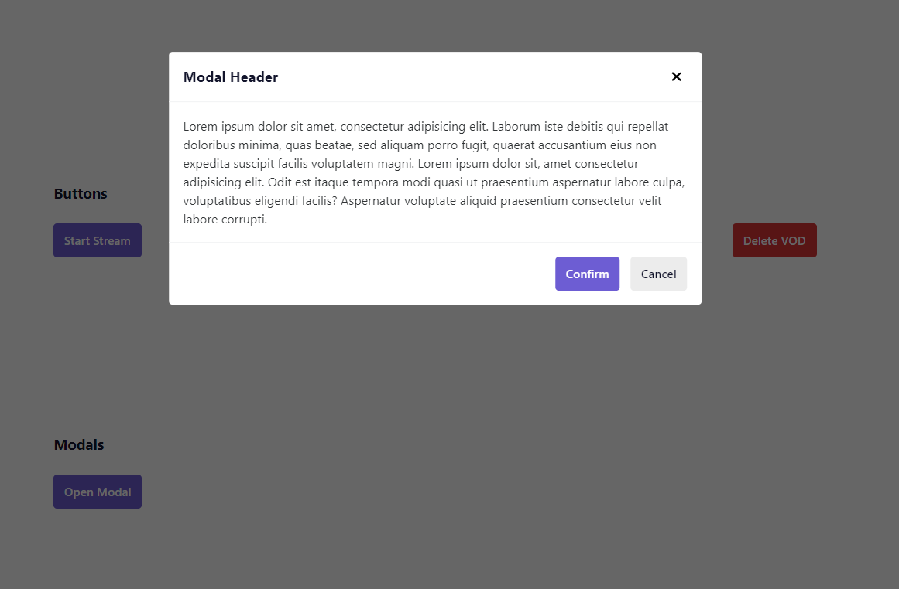

# Welcome to Stencil Components 🙏

## ❓ what it is

> A repository to document my learning while learning basics of stencil from [Udemy](https://www.udemy.com/course/web-components-stenciljs-build-custom-html-elements/) & [YouTube](https://www.youtube.com/watch?v=KzhBkegzjlg&t=8s&ab_channel=WrongAkram). ♥️

## 📸 Demo

### Side Drawer Preview

### Button Preview

### Modal Preview

## 👤 Author

 **alok raj (alokr417@gmail.com)**

* website: https://alokraj.me/
* linkedin: [@alok722](https://linkedin.com/in/alok722)

 

## ✨ Show your support

Give a ⭐️ if this project helped you!